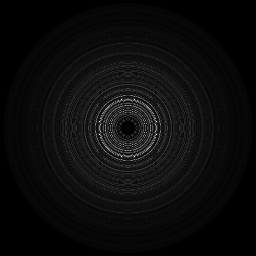

<div align="center">

# SYMPOD: A new benchmark for machine learning applied to powder X-ray diffraction

</div>

<div align="center">



</div>

## :star2: Introduction

In this repository we show how to use the SYMPOD dataset, how to create similar data from CIF files and how to train and test some machine learning models to predict space group from simmulated powder X-ray diffraction (PXRD) patterns using SYMPOD

You can download the SYMPOD dataset from [Science Data Bank](https://www.scidb.cn/en/detail?dataSetId=91574142078b45c79d532d97b294ed44).

We strongly suggest to download only the 'structures' folder if you only want to use the plane PXRD patterns. 

<br>

## :open_file_folder: Dataset Structure

The general data structure is shown below. For a more comprehensive view check the *Turorial/Tutorial.ipynb* file.

```
Data
├── Structures               <- Structural information and PXRD patterns
│   ├── ID0.json                                       
│   │   ├── ID                          
│   │   ├── space_group                 
│   │   ├── alpha                       
│   │   ├── beta                        
│   │   ├── gamma                       
│   │   ├── a                           
│   │   ├── b                           
│   │   ├── c                           
│   │   ├── intensities             
│   │   └── atoms            
│   └── ID1.json
│   │   
│   │   
│
└── Powder Images            <- Created radial images from PXRD patterns
│   ├── ID0.png
│   └── ID1.png
│   │   
│   │   
```
<br>
<br>

<br>

## :wrench: Requirements


## :chart_with_upwards_trend: Data Loading and Use

We provide a tutorial notebook at *Turorial/Tutorial.ipynb* that provides a full explanation on how to load and visualize the data.

## :crystal_ball: Data Creation Process

We created the data following the approach explained on [PAPER]. To replicate this process run the following command, using some example CIF files in the *Data_Creation/Files* folder.

```
python Data_Creation/Extract_Info.py
```

In the *Data_Creation/Data_Utils.py* file, you will find the main functions used to extract information from the CIF files and generate the simulated diffractograms and images. For a detailed mathematical explanation of the image generation process, go to the Methods section of [PAPER].

## :robot: Machine Learning for Space Group Prediction

Here we provide the codes for the space group prediction using the PXRD patterns from SYMPOD, described in [PAPER]. 

### :eyes: Computer Vision Models

To train different computer vision models from scratch run the following command.

```
CUDA_VISIBLE_DEVICES=<GPU_ID> python Space_Group_Prediction/Train.py --model <model_name> --pretrained <True/False> --epochs <epochs> --training_data <1K/100K/All> --batch_size <batch_size> --lr <learning_rate> --gamma <scheduler_gamma> --patience <scheduler_patience>
```

To test a trained model, run the following command:
```
CUDA_VISIBLE_DEVICES=<GPU_ID> python Space_Group_Prediction/Test.py --model <model_name> --weights1 <fold1_best_checkpoint.pt> --weights2 <fold2_best_checkpoint.pt>
```

You can choose one of the following architectures in "*model_name*":

* alexnet
* resnet
* densenet
* swin
* swinv2

For example, to train a swinv2 pretrained model, run the following command.
```
CUDA_VISIBLE_DEVICES=<GPU_ID> python Space_Group_Prediction/Train.py --model swinv2 --pretrained True --epochs 25 --training_data 100K --batch_size 6 --lr 4e-06 --gamma 0.9 --patience 4
```

Then, to test the model, run the following command:
```
CUDA_VISIBLE_DEVICES=<GPU_ID> python Space_Group_Prediction/Test.py --model swinv2 --weights1 'swinv2_pretrained_True_lr_4e-06_bs_6_epochs_25_gamma_0.9_patience_4_data_100K_fold1_Best.pt' --weights2 'swinv2_pretrained_True_lr_3.7e-06_bs_6_epochs_25_gamma_0.9_patience_4_data_100K_fold2_Best.pt'
```

Note that the weights files names include all the hyperparameters of the model and the fold they were trained on.

If you want to replicate the results of [PAPER] download the pretrained models at [Drive](https://drive.google.com/drive/folders/1K_tu-JUu6ksK4c-2MM3lmG0ZzxSAScjI?usp=drive_link). Place the models inside the "Space_Group_Prediction/Models/" folder.

### :computer: AutoML Models

To train and test the classic machine learning models using the PXRD patternsfrom SYMPOD with the H2O AutoML library, first download csv files at [Drive](linkkkkkkkkkkkkkkkkkkkkkkkkkkkkkkkk), place them inside the *Space_Group_Prediction/AutoML_Data/* folder and then run the following command. 

```
python Space_Group_Prediction/automl.py
```

## :page_with_curl: Citation


